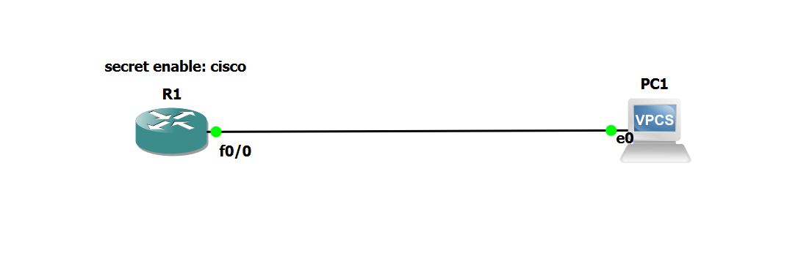

# Cisco Enable Password Configuration in GNS3

## 1. Lab Overview

This lab demonstrates how to configure an **enable secret password** on a Cisco router using **GNS3**.

The purpose of the configuration is to protect access to **privileged EXEC mode** (`R1#`). When a user is in user EXEC mode (`R1>`) and enters the `enable` command, the router will request the configured password.

### Topology

The lab consists of:

* **R1** — Cisco Router
* **PC1** — VPCS (Virtual PC)
* **FastEthernet0/0 (R1)** connected to **Ethernet0 (PC1)**
* Enable secret password: `cisco`

---

## 2. Topology Screenshot

**Screenshot 1 — GNS3 topology**



**Connection:**

```text
R1 FastEthernet0/0  ─────────  PC1 Ethernet0
```

---

## 3. Objective

The objective of this lab is to configure an **enable secret password** on R1.

The password used in this lab is:

```text
cisco
```

After configuration, the router should require the password when moving from:

```text
R1>
```

to:

```text
R1#
```

---

## 4. Configure the Enable Secret

First, access the console of **R1** in GNS3.

Enter privileged EXEC mode:

```cisco
R1> enable
```

Enter global configuration mode:

```cisco
R1# configure terminal
```

Configure the enable secret:

```cisco
R1(config)# enable secret cisco
```

Exit configuration mode:

```cisco
R1(config)# end
```

The configuration is now applied.

---

## 5. Verify the Configuration

To verify that the enable secret has been configured, use:

```cisco
R1# show running-config
```

Look for:

```text
enable secret 5 $1$...
```

The actual password **will not appear as `cisco`** in the running configuration.

Instead, Cisco IOS stores the enable secret in a hashed form.

For example:

```text
enable secret 5 $1$OVpH$BOHJCapsyc8N5otsN0cf/.
```

This indicates that an enable secret has been configured.

---

## 6. Test the Password

To test the password, first leave privileged EXEC mode:

```cisco
R1# disable
```

The prompt should change to:

```text
R1>
```

Now enter:

```cisco
R1> enable
```

The router should ask:

```text
Password:
```

Enter:

```text
cisco
```

If the password is correct, the router returns to:

```text
R1#
```

The process is therefore:

```text
R1>
   |
   | enable
   ↓
Password:
   |
   | cisco
   ↓
R1#
```

---

## 7. Important GNS3 Note

Some Cisco IOS images used in GNS3 may have the console configured with:

```cisco
line console 0
 privilege level 15
```

If this configuration is present, the console may automatically place you directly into:

```text
R1#
```

In that situation, the router will not ask for the enable secret when you first connect because you are **already at privilege level 15**.

For normal enable-password practice, remove the console privilege-level configuration:

```cisco
R1# configure terminal
R1(config)# line console 0
R1(config-line)# no privilege level 15
R1(config-line)# end
```

After reconnecting to the router, you should normally start at:

```text
R1>
```

Then:

```cisco
R1> enable
Password:
```

Enter:

```text
cisco
```

and you should reach:

```text
R1#
```

---

## 8. Key Concepts Learned

### User EXEC Mode

```text
R1>
```

This is the lower-privilege mode used for basic monitoring and limited commands.

### Privileged EXEC Mode

```text
R1#
```

This mode provides access to more powerful commands, including configuration commands.

### Enable Secret

The command:

```cisco
enable secret cisco
```

protects access from:

```text
R1>
```

to:

```text
R1#
```

The password is stored in a hashed form rather than displayed as plain text.

---

## 9. Final Configuration

The main configuration used in this lab is:

```cisco
R1# configure terminal
R1(config)# enable secret cisco
R1(config)# end
```

Verification:

```cisco
R1# show running-config | include enable
```

Expected result:

```text
enable secret 5 $1$...
```

Testing:

```text
R1# disable
R1> enable
Password:
R1#
```

---

## 10. Lab Result

The enable secret was successfully configured on **R1** in GNS3.

The password:

```text
cisco
```

is required when a user moves from **user EXEC mode (`R1>`)** to **privileged EXEC mode (`R1#`)**, provided the console is not already configured to start at privilege level 15.

**Lab completed successfully.**
