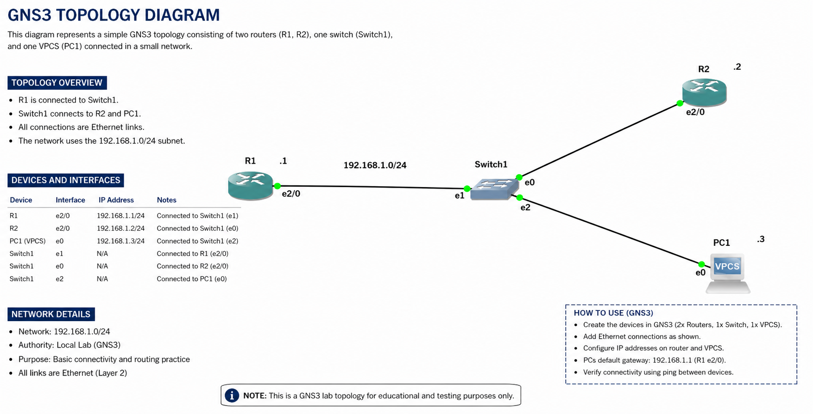

# 🔐 Cisco `service password-encryption` Lab

## 📌 Overview

This lab demonstrates how to use the Cisco IOS command:

```cisco
service password-encryption
```

The purpose is to protect plaintext passwords in the router's configuration by encrypting them.

The lab was created and tested using **GNS3**.

---

## 🗺️ Network Topology



### IP Addressing

| Device | Interface | IP Address     |
| ------ | --------- | -------------- |
| R1     | e2/0      | 192.168.1.1/24 |
| R2     | e2/0      | 192.168.1.2/24 |
| PC1    | e0        | 192.168.1.3/24 |

---

# 🎯 Objectives

The objectives of this lab are to:

* Understand `service password-encryption`
* Configure passwords on a Cisco router
* Observe how passwords appear before encryption
* Enable password encryption
* Verify the encrypted configuration
* Test remote access using Telnet
* Understand the difference between plaintext and encrypted passwords

---

# ⚙️ Configuration

## Step 1 — Configure a Password

Enter global configuration mode on R1:

```cisco
R1# configure terminal
```

Configure an enable password:

```cisco
R1(config)# enable password cisco
```

Configure a VTY password:

```cisco
R1(config)# line vty 0 4
R1(config-line)# password vty123
R1(config-line)# login
R1(config-line)# exit
```

Configure a local username:

```cisco
R1(config)# username ali password test123
```

---

# 🔍 Step 2 — Check the Configuration Before Encryption

Use:

```cisco
R1# show running-config
```

Before enabling password encryption, passwords configured using the `password` keyword may appear in plaintext.

For example:

```text
username ali password test123
!
line vty 0 4
 password vty123
 login
```

This demonstrates why protecting passwords stored in the configuration is important.

---

# 🔐 Step 3 — Enable Password Encryption

Enable the Cisco password-encryption service:

```cisco
R1(config)# service password-encryption
```

This command causes supported plaintext passwords in the configuration to be stored in an encrypted/obfuscated form.

---

# 🔎 Step 4 — Verify the Encryption

Return to privileged EXEC mode:

```cisco
R1(config)# end
```

Then display the configuration:

```cisco
R1# show running-config
```

The passwords should no longer appear in plaintext.

For example, instead of:

```text
username ali password test123
```

you will see an encrypted value after `password`.

You can also use:

```cisco
R1# show running-config | section password
```

---

# 💻 Step 5 — Test Telnet from R2

From R2, verify connectivity:

```cisco
R2# ping 192.168.1.1
```

If connectivity is successful:

```cisco
R2# telnet 192.168.1.1
```

R1 should request the VTY password:

```text
Password:
```

Enter:

```text
vty123
```

Successful authentication demonstrates that password encryption in the configuration does **not** prevent the configured password from being used for authentication.

---

# 🧪 Troubleshooting

## Problem

Passwords are visible in plaintext when viewing the router configuration.

### Possible cause

`service password-encryption` has not been enabled.

### Solution

```cisco
R1(config)# service password-encryption
```

Then verify:

```cisco
R1# show running-config
```

---

## Problem

Telnet does not request a password.

### Check the VTY configuration

```cisco
R1# show running-config | section line vty
```

Make sure the configuration contains:

```text
line vty 0 4
 password vty123
 login
```

---

# ⚠️ Important Security Note

`service password-encryption` provides protection against passwords being displayed as readable plaintext in the configuration, but it is **not strong cryptographic protection**.

For privileged EXEC access, use:

```cisco
enable secret
```

instead of:

```cisco
enable password
```

For example:

```cisco
R1(config)# enable secret cisco
```

`enable secret` provides stronger protection than `enable password`.

---

# 💾 Save the Configuration

Save the configuration with:

```cisco
R1# copy running-config startup-config
```

Press **Enter** when prompted for the destination filename.

---

# 🛠️ Tools Used

* GNS3
* Cisco IOS Router
* GNS3 VPCS
* Cisco Ethernet interfaces
* Telnet

---

# 📚 Commands Practiced

```cisco
service password-encryption
enable password
username ali password test123
line vty 0 4
password vty123
login
show running-config
show running-config | section password
copy running-config startup-config
```

---

# 🎓 Key Learning

The main concept demonstrated in this lab is:

```cisco
service password-encryption
```

It changes how supported passwords are stored in the Cisco IOS configuration, making them less exposed when someone views the configuration.

This lab also demonstrates how configuration security and remote-access authentication work together.

---

## ⚠️ Cisco IOS Image

The Cisco IOS image used for this lab is **not included in this repository**.

Users should provide their own legally obtained compatible Cisco IOS image and configure it in GNS3 before opening the topology.

---


