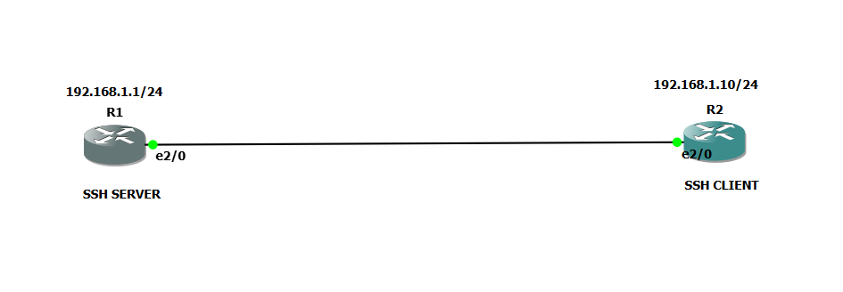

# 🔐 Cisco SSH Remote Access Lab

## 📌 Lab Overview

This lab demonstrates how to configure **R1 as an SSH Server** and **R2 as an SSH Client**.

The goal is to allow the administrator on **R2** to securely connect to **R1** remotely using SSH.

---

## 🖥️ Network Topology



---

## 🌐 IP Addressing

| Device | Interface | IP Address      | Role       |
| ------ | --------- | --------------- | ---------- |
| R1     | e2/0      | 192.168.1.1/24  | SSH Server |
| R2     | e2/0      | 192.168.1.10/24 | SSH Client |

---

# ⚙️ R1 — SSH Server Configuration

## Step 1: Enter Privileged and Global Configuration Mode

```text
R1> enable
R1# configure terminal
```

---

## Step 2: Configure the Hostname

```text
R1(config)# hostname R1
```

The hostname identifies the router as **R1**.

---

## Step 3: Configure the Domain Name

```text
R1(config)# ip domain-name lab.local
```

The domain name is required when generating the RSA keys used by SSH.

---

## Step 4: Configure the Interface IP Address

```text
R1(config)# interface e2/0
R1(config-if)# ip address 192.168.1.1 255.255.255.0
R1(config-if)# no shutdown
R1(config-if)# exit
```

R1's SSH server will be reachable at:

```text
192.168.1.1
```

---

## Step 5: Generate RSA Keys

```text
R1(config)# crypto key generate rsa
```

When prompted:

```text
How many bits in the modulus [512]: 1024
```

RSA keys are used to secure the SSH connection.

---

## Step 6: Enable SSH Version 2

```text
R1(config)# ip ssh version 2
```

SSH version 2 provides the modern SSH protocol.

---

## Step 7: Create a Local User

```text
R1(config)# username admin privilege 15 secret YourSecurePassword
```

This creates:

* Username: `admin`
* Privilege level: `15`
* Password: `YourSecurePassword`

The local account will be used to authenticate the SSH user.

---

## Step 8: Configure the VTY Lines

```text
R1(config)# line vty 0 4
R1(config-line)# login local
R1(config-line)# transport input ssh
R1(config-line)# exit
```

### Explanation

```text
line vty 0 4
```

Selects the virtual terminal lines used for remote access.

```text
login local
```

Tells R1 to use the locally configured username and password.

```text
transport input ssh
```

Allows **SSH only** on the VTY lines.

---

# 💻 R2 — SSH Client Configuration

## Step 1: Configure R2's Interface

```text
R2> enable
R2# configure terminal

R2(config)# interface e2/0
R2(config-if)# ip address 192.168.1.10 255.255.255.0
R2(config-if)# no shutdown
R2(config-if)# exit
```

R2's IP address is:

```text
192.168.1.10
```

---

# 🧪 Step 2: Test Connectivity

Before attempting SSH, test whether R2 can reach R1.

From R2:

```text
R2# ping 192.168.1.1
```

Expected result:

```text
!!!!!
```

This indicates that R2 can reach R1.

---

# 🔑 Step 3: Connect to R1 Using SSH

From R2, enter:

```text
R2# ssh -l admin 192.168.1.1
```

### Command breakdown

```text
ssh
```

Starts an SSH connection.

```text
-l admin
```

Specifies the username `admin`.

```text
192.168.1.1
```

Specifies the IP address of the SSH server, R1.

---

## 🔐 Password Prompt

R2 should display:

```text
Password:
```

Enter:

```text
YourSecurePassword
```

If authentication is successful, you should see:

```text
R1>
```

You are now remotely connected to **R1 from R2**.

---

# ⭐ Step 4: Enter Privileged EXEC Mode

After connecting:

```text
R1> enable
```

You should get:

```text
R1#
```

You are now in privileged EXEC mode on R1.

---

# 🔄 SSH Connection Flow

```text
                 SSH
        ┌─────────────────────┐
        │                     │
        ▼                     │
+----------------+            │
|      R2        |            │
|  SSH CLIENT    |            │
|                |            │
| 192.168.1.10   |            │
+----------------+            │
        │                     │
        │  ssh -l admin       │
        │  192.168.1.1        │
        │                     │
        └─────────────────────┤
                              ▼
                    +----------------+
                    |       R1       |
                    |  SSH SERVER    |
                    |                |
                    | 192.168.1.1    |
                    +----------------+
```

---

# 🔍 Verification Commands

On R1, you can verify SSH configuration with:

```text
R1# show ip ssh
```

To check the VTY configuration:

```text
R1# show running-config
```

To check the interface:

```text
R1# show ip interface brief
```

You should see something similar to:

```text
Interface              IP-Address      Status
Ethernet2/0            192.168.1.1     up
```

---

# ❌ Troubleshooting

If SSH does not work, check the following.

### 1. Check connectivity

From R2:

```text
R2# ping 192.168.1.1
```

If the ping fails, troubleshoot the IP address, interface, cable, or subnet mask.

### 2. Check the SSH configuration

On R1:

```text
R1# show ip ssh
```

### 3. Check the RSA keys

```text
R1# show crypto key mypubkey rsa
```

### 4. Check the VTY configuration

```text
R1# show running-config | section line vty
```

You should have:

```text
line vty 0 4
 login local
 transport input ssh
```

### 5. Check the local user

```text
R1# show running-config | include username
```

You should see the `admin` user.

---

# 🧠 What I Learned

This lab demonstrates:

* How SSH works between two routers
* How to configure a router as an SSH server
* How to configure a router as an SSH client
* How to generate RSA keys
* How to create a local administrator account
* How to configure VTY lines
* How to allow SSH instead of Telnet
* How to test connectivity using `ping`
* How to remotely access a Cisco router

---

# ✅ Final SSH Command

The most important command in this lab is:

```text
R2# ssh -l admin 192.168.1.1
```

**R2 = SSH Client**

**R1 = SSH Server**

**192.168.1.1 = R1's SSH server address**

**admin = SSH username**
