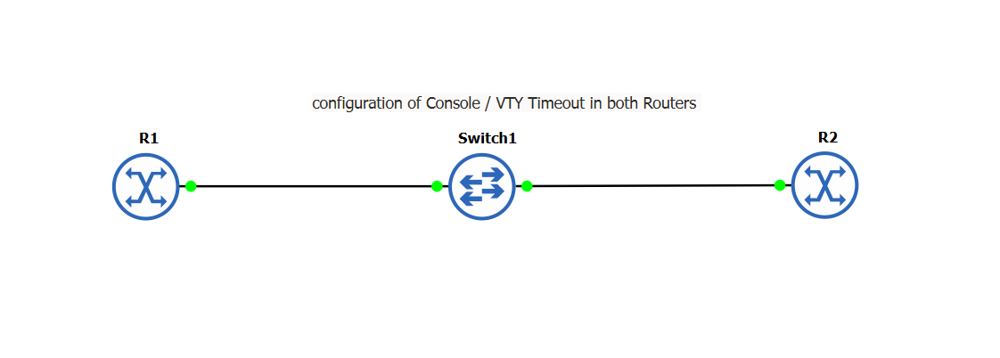

# ⏱️ Cisco Console / VTY Timeout Configuration

## 📌 Lab Overview

This lab demonstrates how to configure an **EXEC session timeout** on both Cisco routers.

The timeout is configured on:

* **Console line (`line con 0`)**
* **VTY lines (`line vty 0 4`)**

The purpose is to automatically terminate an inactive management session after a specified period of time.

---

## 🖥️ Network Topology



### Topology Type

**Linear / Star topology**

The two routers are connected through a central switch.

```text
R1  <-------->  Switch1  <-------->  R2
```

---

# 🎯 Lab Objectives

By completing this lab, you will learn how to:

* Configure a timeout for console sessions.
* Configure a timeout for VTY sessions.
* Understand the difference between console and VTY access.
* Automatically disconnect inactive management sessions.
* Apply the same timeout configuration to both R1 and R2.

---

# 🧠 What Is an EXEC Timeout?

An **EXEC timeout** automatically logs a user out of a Cisco device when there has been no activity for a specified period.

This is useful for security.

For example, if an administrator connects to a router and leaves the session inactive, the router can automatically terminate the session instead of leaving the management session open indefinitely.

---

# ⚙️ R1 Configuration

Enter privileged EXEC mode:

```text
R1> enable
```

Enter global configuration mode:

```text
R1# configure terminal
```

---

## Step 1: Configure Console Timeout

```text
R1(config)# line con 0
R1(config-line)# exec-timeout 20 20
```

### Explanation

```text
line con 0
```

Selects the router's **console line**.

The console line is used when an administrator connects directly to the router through the console connection.

```text
exec-timeout 20 20
```

The two numbers represent:

```text
exec-timeout <minutes> <seconds>
```

Therefore:

```text
exec-timeout 20 20
```

means:

**20 minutes and 20 seconds of inactivity before the EXEC session is terminated.**

---

## Step 2: Configure VTY Timeout

```text
R1(config-line)# line vty 0 4
R1(config-line)# exec-timeout 20 20
R1(config-line)# exit
```

### Explanation

```text
line vty 0 4
```

Selects VTY lines **0 through 4**.

VTY lines are used for **remote management**, such as:

* Telnet
* SSH

The command:

```text
exec-timeout 20 20
```

sets the VTY inactivity timeout to **20 minutes and 20 seconds**.

---

# ⚙️ R2 Configuration

The same configuration is applied to R2.

Enter privileged EXEC mode:

```text
R2> enable
```

Enter global configuration mode:

```text
R2# configure terminal
```

### Console Timeout

```text
R2(config)# line con 0
R2(config-line)# exec-timeout 20 20
```

### VTY Timeout

```text
R2(config-line)# line vty 0 4
R2(config-line)# exec-timeout 20 20
R2(config-line)# exit
```

---

# 📋 Complete Configuration

## R1

```text
R1> enable
R1# configure terminal

R1(config)# line con 0
R1(config-line)# exec-timeout 20 20

R1(config-line)# line vty 0 4
R1(config-line)# exec-timeout 20 20

R1(config-line)# exit
```

## R2

```text
R2> enable
R2# configure terminal

R2(config)# line con 0
R2(config-line)# exec-timeout 20 20

R2(config-line)# line vty 0 4
R2(config-line)# exec-timeout 20 20

R2(config-line)# exit
```

---

# 🔍 Understanding the Two Types of Access

```text
                  MANAGEMENT ACCESS

             +-----------------------+
             |                       |
             v                       v
       Console Access          Remote Access
       line con 0              line vty 0 4
             |                       |
             v                       v
        Physical Console        SSH / Telnet
```

### Console

```text
line con 0
```

Used for **local/physical access** to the router.

### VTY

```text
line vty 0 4
```

Used for **remote access** to the router.

For example:

```text
PC ───── Network ───── R1
             |
            SSH
```

---

# ⏱️ Understanding `exec-timeout 20 20`

The command:

```text
exec-timeout 20 20
```

can be broken down as:

```text
exec-timeout    20       20
     │           │        │
     │           │        └── Seconds
     │           └─────────── Minutes
     └─────────────────────── Timeout command
```

Therefore:

```text
20 minutes + 20 seconds
```

If the user does not interact with the router for that amount of time, the session is automatically terminated.

---

# 🔎 Verification

After configuring the timeout, verify the configuration using:

```text
R1# show running-config
```

You can also inspect the console configuration:

```text
R1# show running-config | section line con
```

And the VTY configuration:

```text
R1# show running-config | section line vty
```

The configuration should contain:

```text
line con 0
 exec-timeout 20 20

line vty 0 4
 exec-timeout 20 20
```

Perform the same verification on R2.

---

# 🧪 Testing

To test the configuration:

1. Access the router through the console or a remote VTY session.
2. Stop entering commands.
3. Wait until the configured inactivity period expires.
4. The router should terminate the inactive EXEC session.

For this lab, the configured timeout is:

```text
20 minutes 20 seconds
```

---

# 🔐 Why Configure EXEC Timeout?

EXEC timeout is an important security measure.

Without a timeout, an administrator could leave a router management session open for a long time.

For example:

```text
Administrator
      |
      v
+-------------+
|     R1      |
|             |
| Open Session|
+-------------+
      |
      | Administrator leaves
      |
      v
Session remains open
```

With an EXEC timeout:

```text
Administrator
      |
      v
+-------------+
|     R1      |
|             |
| Open Session|
+-------------+
      |
      | No activity
      |
      v
20m 20s
      |
      v
Session terminated
```

This reduces the risk of someone gaining access to an unattended management session.

---

# 📚 Key Commands

| Command                                   | Purpose                                  |
| ----------------------------------------- | ---------------------------------------- |
| `line con 0`                              | Enters console-line configuration        |
| `line vty 0 4`                            | Enters VTY-line configuration            |
| `exec-timeout 20 20`                      | Sets 20 minutes 20 seconds of inactivity |
| `show running-config`                     | Displays the current configuration       |
| `show running-config \| section line con` | Displays console-line configuration      |
| `show running-config \| section line vty` | Displays VTY configuration               |

---

# ✅ Expected Result

Both routers should have the following configuration:

```text
R1
 ├── Console → 20 minutes 20 seconds timeout
 └── VTY 0-4 → 20 minutes 20 seconds timeout

R2
 ├── Console → 20 minutes 20 seconds timeout
 └── VTY 0-4 → 20 minutes 20 seconds timeout
```

---

# 📝 Conclusion

In this lab, **R1 and R2** were configured with an EXEC timeout for both console and VTY access.

The command:

```text
exec-timeout 20 20
```

ensures that inactive management sessions are automatically terminated after **20 minutes and 20 seconds**.

This configuration is useful for improving the security of Cisco network devices, particularly when administrators leave management sessions unattended.
