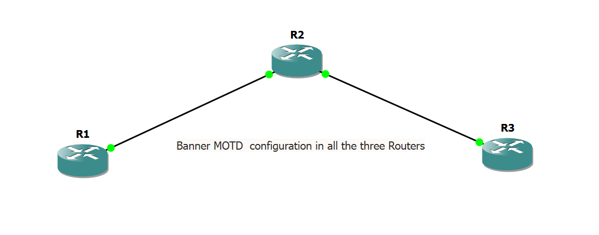

# Cisco Banner MOTD Configuration

## 1. Overview

A **Banner MOTD (Message of the Day)** displays a message when someone connects to a Cisco router or switch.

It is commonly used to display a warning such as:

> **Authorized users only. Unauthorized access is prohibited.**

In this lab, we configure a Banner MOTD on **R1, R2, and R3**.

---

## 2. Topology



Devices:

* R1 – Cisco Router
* R2 – Cisco Router
* R3 – Cisco Router

---

## 3. Objective

By the end of this lab, you will be able to:

* Configure a Banner MOTD.
* Display a warning message when accessing a router.
* Verify that the banner is working.

---

## 4. Configuration

### R1

```text
R1> enable
R1# configure terminal

R1(config)# banner motd # Authorized Access Only - R1 #

R1(config)# end
R1# copy running-config startup-config
```

### R2

```text
R2> enable
R2# configure terminal

R2(config)# banner motd # Authorized Access Only - R2 #

R2(config)# end
R2# copy running-config startup-config
```

### R3

```text
R3> enable
R3# configure terminal

R3(config)# banner motd # Authorized Access Only - R3 #

R3(config)# end
R3# copy running-config startup-config
```

---

## 5. Verify the Configuration

On each router, use:

```text
show running-config
```

Look for:

```text
banner motd # Authorized Access Only - R1 #
```

You can also exit and reconnect to the router to see the banner.

Example:

```text
R1# exit
```

When you access R1 again, you should see:

```text
Authorized Access Only - R1
```

---

## 6. Important Command

The main command used in this lab is:

```text
banner motd # message #
```

The `#` symbols are delimiters. You can use another character, but the same character must be used at the beginning and end.

Example:

```text
banner motd # WARNING: Unauthorized access is prohibited! #
```

---

## 7. Expected Result

When a user connects to the router, the configured warning message is displayed.

Example:

```text
Authorized Access Only - R1
```

This helps inform users that the device is restricted to authorized personnel.

---

## 8. Screenshot

Take **one screenshot at the end** showing the Packet Tracer topology and the configured Banner MOTD result.
