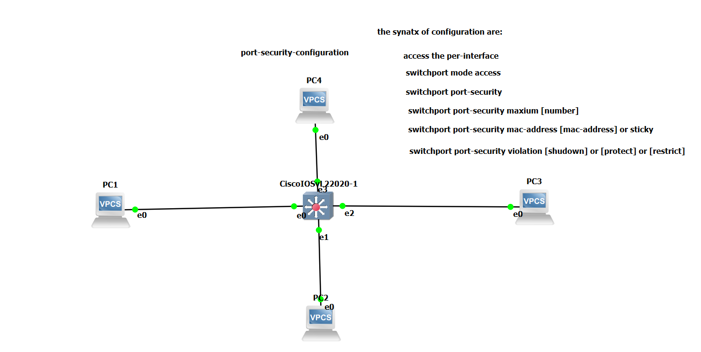

# Cisco Switch Port Security Configuration

## 1. Overview

**Port Security** is a Cisco switch security feature that controls which **MAC addresses** are allowed to use a switch port.

In this lab, we configure Port Security on four switch interfaces connected to **PC1, PC2, PC3, and PC4**.

We will use:

* **Access mode** → each port connects to an end device.
* **Port Security** → protects the port.
* **Maximum 1 MAC address** → only one device is allowed per port.
* **Sticky MAC** → the switch automatically learns the MAC address.
* **Shutdown violation** → the port is shut down if an unauthorized MAC address is detected.

---

## 2. Topology



### Devices:

* PC1 – VPCS
* PC2 – VPCS
* PC3 – VPCS
* PC4 – VPCS
* CiscoIOSvL2 22020-1 – Cisco Layer 2 Switch

### Connections:

```text
                                   PC4
                                 (VPCS)
                                    |
                                    | e0
                                    |
                                    | e3
                                    |
   PC1                      +---------------+                      PC3
 (VPCS) ---- e0 ------- e0 |  CiscoIOSvL2  | e2 ------- e0 ---- (VPCS)
                            |    22020-1    |
                            +---------------+
                                    | e1
                                    |
                                    | e0
                                    |
                                   PC2
                                 (VPCS)
```

---

## 3. Objective

By the end of this lab, you will be able to:

* Configure a switch port as an **access port**.
* Enable **Port Security**.
* Allow only **one MAC address** on each port.
* Configure **Sticky MAC learning**.
* Configure **shutdown violation mode**.
* Verify Port Security configuration.
* Understand how the switch reacts to an unauthorized device.

---

## 4. Configuration

We will configure Port Security on the four interfaces connected to the PCs.

### PC1 – Ethernet 0/0

```text
Switch> enable

Switch# configure terminal

Switch(config)# interface ethernet 0/0

Switch(config-if)# switchport mode access

Switch(config-if)# switchport port-security

Switch(config-if)# switchport port-security maximum 1

Switch(config-if)# switchport port-security mac-address sticky

Switch(config-if)# switchport port-security violation shutdown

Switch(config-if)# exit
```

### PC2 – Ethernet 0/1

```text
Switch(config)# interface ethernet 0/1

Switch(config-if)# switchport mode access

Switch(config-if)# switchport port-security

Switch(config-if)# switchport port-security maximum 1

Switch(config-if)# switchport port-security mac-address sticky

Switch(config-if)# switchport port-security violation shutdown

Switch(config-if)# exit
```

### PC3 – Ethernet 0/2

```text
Switch(config)# interface ethernet 0/2

Switch(config-if)# switchport mode access

Switch(config-if)# switchport port-security

Switch(config-if)# switchport port-security maximum 1

Switch(config-if)# switchport port-security mac-address sticky

Switch(config-if)# switchport port-security violation shutdown

Switch(config-if)# exit
```

### PC4 – Ethernet 0/3

```text
Switch(config)# interface ethernet 0/3

Switch(config-if)# switchport mode access

Switch(config-if)# switchport port-security

Switch(config-if)# switchport port-security maximum 1

Switch(config-if)# switchport port-security mac-address sticky

Switch(config-if)# switchport port-security violation shutdown

Switch(config-if)# exit

Switch(config)# end

Switch# copy running-config startup-config
```

---

## 5. Explanation of the Configuration

### `switchport mode access`

```text
switchport mode access
```

Makes the interface an **access port** for an end device such as a PC.

### `switchport port-security`

```text
switchport port-security
```

Enables **Port Security** on the interface.

### `switchport port-security maximum 178`

```text
switchport port-security maximum 1
```

Allows a maximum of **one MAC address** on the port.

### `switchport port-security mac-address sticky`

```text
switchport port-security mac-address sticky
```

The switch **automatically learns the PC's MAC address** and treats it as a secure MAC address.

### `switchport port-security violation shutdown`

```text
switchport port-security violation shutdown
```

If an unauthorized MAC address is detected, the switch **shuts down the port**.

---

## 6. Verify the Configuration

### Check Port Security on all interfaces

```text
Switch# show port-security
```

This displays the Port Security status of the interfaces.

### Check one specific interface

For PC1:

```text
Switch# show port-security interface ethernet 0/0
```

You should see information similar to:

```text
Port Security              : Enabled
Port Status                 : Secure-up
Violation Mode              : Shutdown
Maximum MAC Addresses       : 1
Total MAC Addresses         : 1
Configured MAC Addresses    : 0
Sticky MAC Addresses        : 1
```

### Check the MAC address table

```text
Switch# show mac address-table
```

This shows the MAC addresses learned by the switch.

---

## 7. Test Port Security

First, allow the PCs to communicate with the switch so that their MAC addresses are learned.

For example, from PC1:

```text
PC1> ping <destination-ip>
```

Then check the port:

```text
Switch# show port-security interface ethernet 0/0
```

The switch should show **1 secure MAC address**.

Because we configured:

```text
switchport port-security maximum 1
```

only one MAC address is allowed on each port.

If a different unauthorized device is connected to the port, a security violation occurs.

Because we configured:

```text
switchport port-security violation shutdown
```

the switch places the interface into an error-disabled/shutdown state.

---

## 8. Important Commands

### Enable Port Security

```text
switchport port-security
```

### Allow one MAC address

```text
switchport port-security maximum 1
```

### Automatically learn the MAC address

```text
switchport port-security mac-address sticky
```

### Shut down the port after a violation

```text
switchport port-security violation shutdown
```

### Verify Port Security

```text
show port-security
```

### Verify a specific interface

```text
show port-security interface ethernet 0/0
```

### View learned MAC addresses

```text
show mac address-table
```

---

## 9. Expected Result

After configuration:

* PC1 → only **one MAC address** is allowed on e0/0.
* PC2 → only **one MAC address** is allowed on e0/1.
* PC3 → only **one MAC address** is allowed on e0/2.
* PC4 → only **one MAC address** is allowed on e0/3.
* The switch automatically learns each PC's MAC address using **sticky learning**.
* An unauthorized MAC address causes the port to be **shut down**.

The final configuration provides basic Layer 2 security by preventing unauthorized devices from using the protected switch ports.

---

For example:

```text
Switch# show port-security
```

and/or:

```text
Switch# show port-security interface ethernet 0/0
```
